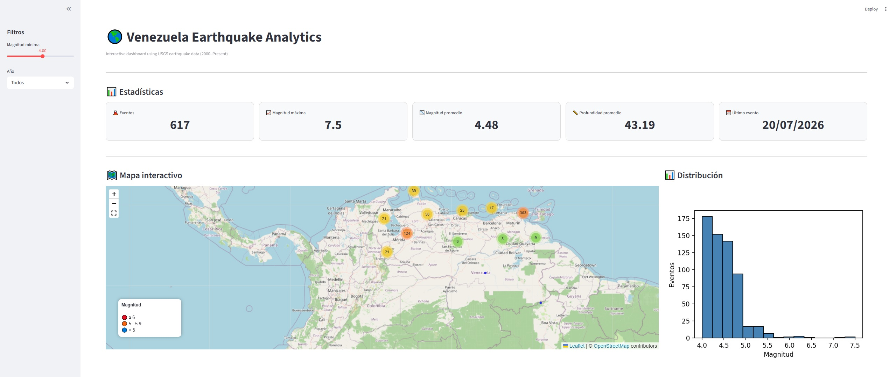
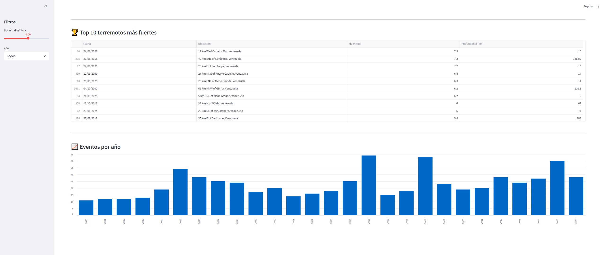
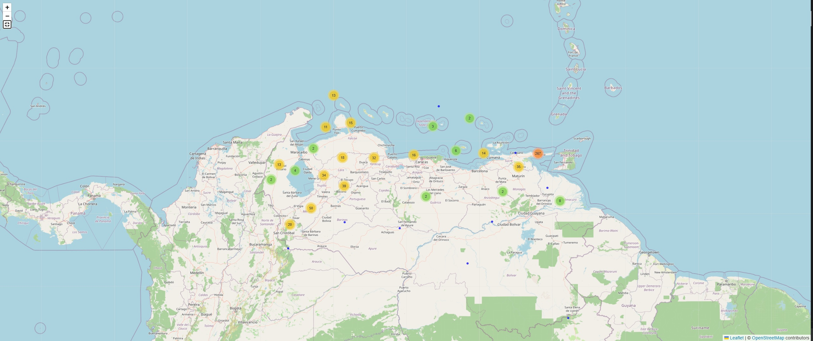

# 🌎 Venezuela Earthquake Analytics

Interactive dashboard for analyzing earthquakes in Venezuela using historical data from the **USGS Earthquake Catalog**.

The project retrieves earthquake records, processes the data with **Pandas**, generates interactive visualizations with **Folium**, and presents them through a **Streamlit dashboard**.

---

## 📸 Dashboard Preview


### Dashboard






### Interactive Map



---

## 🚀 Features

- 📥 Automatic download of earthquake data from the USGS API.
- 🧹 Data cleaning and preprocessing.
- 📂 Organized project structure (`raw` and `processed` datasets).
- 📊 Interactive dashboard with Streamlit.
- 🌎 Interactive map with Folium.
- 📍 Marker clustering for better visualization.
- 🎨 Color classification according to earthquake magnitude.
- 📈 Histogram of earthquake magnitudes.
- 📅 Filtering by year.
- 🎚️ Minimum magnitude filter.
- 📋 Top 10 strongest earthquakes.
- 📌 Summary statistics:
  - Number of events
  - Maximum magnitude
  - Average magnitude
  - Average depth
  - Date of the latest event

---

## 🗂️ Project Structure

```
terremotos_venezuela/
│
├── app.py
├── requirements.txt
├── README.md
│
├── data
│   ├── raw
│   │   └── terremotos_venezuela.csv
│   │
│   └── processed
│       └── terremotos_venezuela_filtrado.csv
│
├── notebooks
│   ├── mapa_terremotos_venezuela.html
│   └── Terre.ipynb
│
└── images
    ├── dashboard1.jpg
    ├── dashboard2.jpg
    └── map.jpg
```

---

## 📊 Dashboard

The dashboard includes:

### 🌋 KPIs

- Number of earthquakes
- Maximum magnitude
- Average magnitude
- Average depth
- Latest recorded event

### 🌎 Interactive Map

- Marker clustering
- Interactive popups
- Full-screen mode
- Color legend

### 📈 Charts

- Magnitude distribution
- Earthquakes per year

### 🏆 Top 10 Earthquakes

Displays the strongest earthquakes recorded in the selected period.

---

## ⚙️ Installation

Clone the repository:

```bash
git clone https://github.com/Nasabunc09/geoai-earthquake-analytics-venez.git

cd geoai-earthquake-analytics-venez
```

Install dependencies:

```bash
pip install -r requirements.txt
```

Run the dashboard:

```bash
streamlit run app.py
```

---

## 📦 Technologies

- Python
- Pandas
- Streamlit
- Folium
- Matplotlib
- USGS Earthquake API

---

## 📈 Data Source

United States Geological Survey (USGS)

https://earthquake.usgs.gov/

---

## 🎯 Future Improvements

- HeatMap visualization
- Plotly interactive charts
- Monthly and yearly trends
- Earthquake depth analysis
- Export filtered data
- Deployment on Streamlit Community Cloud

---

## 👩‍💻 Author

**Cyntia Nasabun**

Computer Science Student | Data Science | AI | Python | Web Development

LinkedIn:
[https://www.linkedin.com/in/cyntia-nasabun-pantoja-b7499288/]

GitHub:
[https://github.com/Nasabunc09]